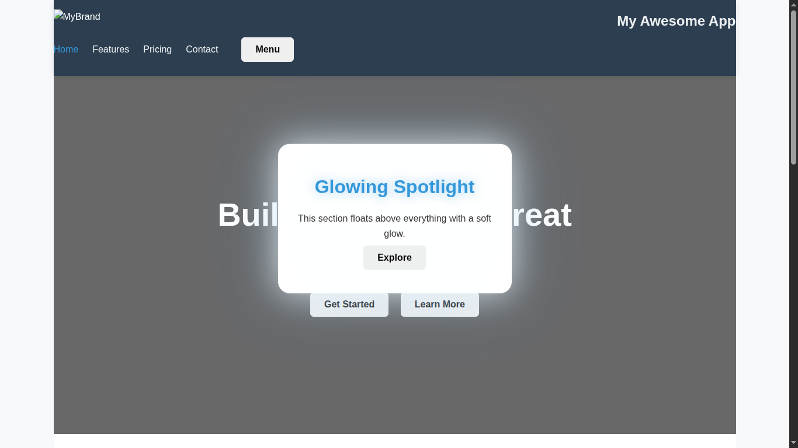
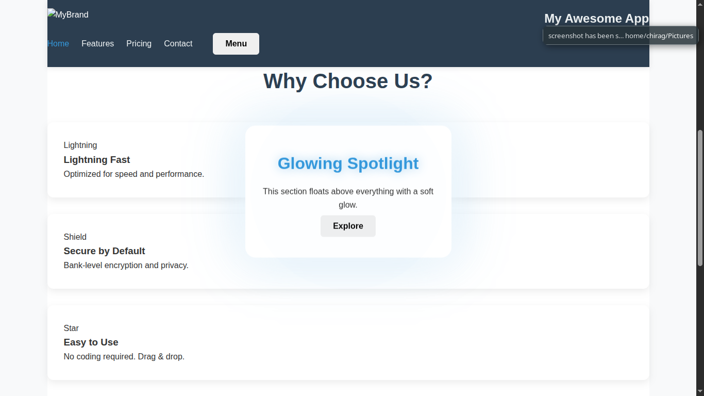
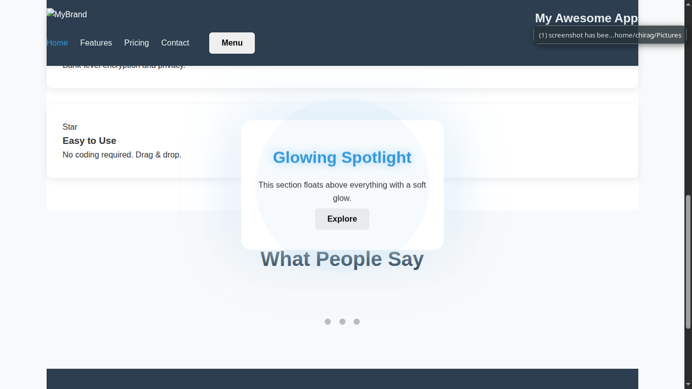

# MHTML 
**MHTML is an programming language that compiles into HTML which then can be displayed on browsers MHTML uses curly brackets {} instead of angular brackets to make the code more readable . Currently MHTML supports only few HTML elements lkie `img` , `h1` ,`p` ,`ul` etc and allows to refer to links and filepaths**

---

## Features

| Feature | Status |
|-------|--------|
| Compile to `.html` | Done |
| Custom `.mhtml` parser (lexer + recursive descent) | Done |
| AST with tags, classes, properties, text | Done |
| **OpenGL 2D rendering engine** | In Progress |
| Draw `@div`, `@img`, `@h1`, etc. as colored objects | Done |
| Render text with **FreeType** or bitmap fonts | Planned |
| CSS-like class support (`.card`, `.primary`) | Planned |
| Layout system (flexbox-like) | Planned |

---

## [ShowCase]

**This page was written in `MHTML`**





## Syntax (`.mhtml`)

```mhtml
@div .app-container id:app {
    @header .navbar .sticky {
        @div .logo {
            @img src:"logo.svg" alt:"MyBrand" {}
            @h1 .brand-title { "My Awesome App" }
        }
        @nav .menu {
            @ul {
                @li .active { @a href:"#home" { "Home" } }
                @li { @a href:"#features" { "Features" } }
                @li { @a href:"#pricing" { "Pricing" } }
                @li { @a href:"#contact" { "Contact" } }
            }
            @button .btn .btn-primary .menu-toggle { "Menu" }
        }
    }

    @main .content {
        @section .hero .parallax id:hero {
            @div .overlay {}
            @div .hero-text {
                @h1 .animate-fade { "Build Something Great" }
                @p .subtitle { "A modern, fast, and beautiful experience." }
                @button .btn .btn-large .btn-gradient { "Get Started" }
                @button .btn .btn-outline { "Learn More" }
            }
        }

        @section .features id:features {
            @h2 .section-title { "Why Choose Us?" }
            @div .grid .grid-3 {
                @div .card .feature-card .shadow-hover {
                    @div .icon .bg-primary { "Lightning" }
                    @h3 { "Lightning Fast" }
                    @p { "Optimized for speed and performance." }
                }
                @div .card .feature-card .shadow-hover {
                    @div .icon .bg-success { "Shield" }
                    @h3 { "Secure by Default" }
                    @p { "Bank-level encryption and privacy." }
                }
                @div .card .feature-card .shadow-hover {
                    @div .icon .bg-warning { "Star" }
                    @h3 { "Easy to Use" }
                    @p { "No coding required. Drag & drop." }
                }
            }
        }

        @section .testimonials id:testimonials {
            @h2 .section-title { "What People Say" }
            @div .carousel {
                @div .slide .active {
                    @blockquote {
                        @p { "This changed how I work. Incredible tool!" }
                        @footer { "— Sarah Chen, Designer" }
                    }
                }
                @div .slide {
                    @blockquote {
                        @p { "Best investment this year. Highly recommend." }
                        @footer { "— Mark Torres, CEO" }
                    }
                }
                @div .slide {
                    @blockquote {
                        @p { "Clean, fast, and beautiful. Love it!" }
                        @footer { "— Alex Kim, Developer" }
                    }
                }
            }
            @div .dots {
                @span .dot .active {}
                @span .dot {}
                @span .dot {}
            }
        }
    }

    @footer .footer-dark {
        @div .footer-top {
            @div .footer-column {
                @h4 { "Product" }
                @ul {
                    @li { @a href:"#features" { "Features" } }
                    @li { @a href:"#pricing" { "Pricing" } }
                    @li { @a href:"#updates" { "Updates" } }
                }
            }
            @div .footer-column {
                @h4 { "Company" }
                @ul {
                    @li { @a href:"#about" { "About" } }
                    @li { @a href:"#blog" { "Blog" } }
                    @li { @a href:"#careers" { "Careers" } }
                }
            }
            @div .footer-column {
                @h4 { "Support" }
                @ul {
                    @li { @a href:"#help" { "Help Center" } }
                    @li { @a href:"#contact" { "Contact" } }
                    @li { @a href:"#status" { "Status" } }
                }
            }
            @div .footer-column .social {
                @h4 { "Follow Us" }
                @div .social-icons {
                    @a href:"https://facebook.com" .icon { "FB" }
                    @a href:"https://twitter.com" .icon { "TW" }
                    @a href:"https://instagram.com" .icon { "IG" }
                    @a href:"https://github.com" .icon { "GH" }
                }
            }
        }
    }
}
```

### Supported:
- `@tag` → rectangle
- `.class` → styling (color, border, etc.)
- `prop:value` → width, height, padding, etc.
- Text → rendered inside
- Nested layout

---

## Project Structure

```
mhtml-opengl/
├── Compiler
│   ├── parser.cpp
│   └── parser.h
├── graphics.cpp
├── graphics.h
├── index.html
├── index.mhtml
├── LanguageHighlight
├── main
├── main.cpp
├── README.md
└── style.css
```

---
### Compile

```bash
g++ main.cpp Compiler/parser.cpp -o main
```

### Run

```bash
./main index.mhtml
```

---

## Example: `index.mhtml`

```mhtml
@div .container {
    @h1 .title { "MHTML + OpenGL" }
    @div .card {
        @p { "This is a card" }
        @button { "Click" }
    }
}
```

---


## Debug Mode([COMMING SOON])

Run with:

```bash
./mhtml-viewer --debug
```

→ Prints **AST tree** + **render log**

---

## Contributing

1. Fork
2. Create branch: `feature/text-rendering`
3. Commit
4. Open PR

**Ideas welcome:**
- Font system
- Layout algorithms
- Shader effects
- Animation

---


**Star if you’re building the future of declarative UIs in C++!**
